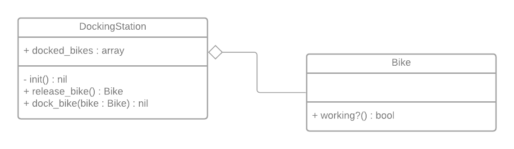

# Boris Bikes Challenges

This is a project based on London's [Boris Bikes](https://tfl.gov.uk/modes/cycling/santander-cycles) (i.e. 'Santander Cycles')

## How to use

```shell
rspec
```

## Technical Details

The program uses two classes: DockingStation & Bike



DockingStation can:
- Release a bike, where it returns a Bike object. (In the future this will be a Bike from the docked_bikes array)
- Dock a bike, where it adds a Bike object to the docked_bikes array

Bike has one method:
- working?, which returns its' working status (true/false)
